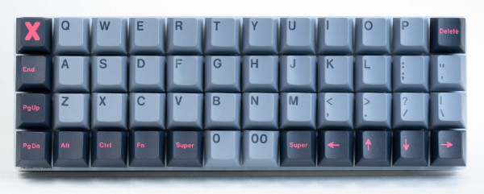

# T-Rex Typing
The t-rex is known for many things, but of those things, its typing ability is not one of them. With only two fingers, it's pretty challenging to type on a standard QWERTY keyboard! Rather than deal with the positions and the resulting awkward movements on a standard keyboard, Tipo the t-rex uses ortholinear (gridlike) keyboards, such as the one displayed below.



To further compensate for the lack of finger dexterity, before typing anything, Tipo remaps the keys on his keyboard based on what he needs to type, such that his fingers move as little as possible.

Additionally, Tipo found that pressing two keys simultaneously was too much of a hassle. Thus, Tipo has [sticky keys](https://en.wikipedia.org/wiki/Sticky_keys) enabled. In effect, instead of needing to hold shift to type a capital letter, Tipo can tap and release shift, and then tap a key to get the shifted version.

Finally, Tipo found it all too easy to lose his place when trying to move from one key to the next without returning his fingers to the home row. After every keypress, the finger that pressed a key returns to its original position on the home row.

Given a body of text, determine the minimum total distance that Tipo's fingers will travel, assuming he places the keys optimally.

## Input
Input consists of a single line containing a string $s$, the text to be typed by the t-rex.

## Constraints
* $0 < |s| \leq 10^6$
* The only characters that will require shifting are letters
* Apart from capital letters, assume that all characters will have a dedicated key (e.g., you can type an exclamation point with a `!` key, rather than pressing `SHIFT + 1`)
* All characters will be standard characters that can be seen on a standard QWERTY keyboard

## Output
A single decimal number representing the minimum distance that Tipo's fingers must travel, rounded to the nearest $0.001$.

## Notes
* Assume that Tipo's fingers rest at the positions that correspond to d, f, j, and k on a standard keyboard. More formally:
    * Fingers rest on the same row
    * Fingers from the same hand rest on adjacent keys
    * There are two keys between the index fingers
* Each key is a 1 unit square and shares its edges with the four keys adjacent to it
* Distance between keys is measured from center to center
* The keyboard has as many columns and rows as you decide

## Examples
The first three test cases are the following examples.

### Example 0
#### Input
```
asdf
```

#### Output
```
0.0
```

#### Explanation
With two fingers on each hand, the letters can be placed under the fingers' resting positions, requiring no movement, like so:
```
+---+---+---+---+---+---+
| a | s |   |   | d | f |
+---+---+---+---+---+---+
```

### Example 1
#### Input
```
peter piper picked a peck of pickled peppers
```

#### Output
```
34.0
```

#### Explanation
This is just one of many possible layouts:
```
+---+---+---+---+---+---+
| a | t |   |   | k | d |
+---+---+---+---+---+---+
| p | e | i | c | _ | r |
+---+---+---+---+---+---+
| o | f |   |   | l | s |
+---+---+---+---+---+---+
```
*Note*: for illustrative purposes, `_` represents a space

### Example 2
#### Input
```
O Romeo, Romeo, wherefore art thou Romeo?
```

#### Output
```
36.0
```

#### Explanation
This is one possible layout:
```
+---+---+---+---+---+---+
| a | f |   |   | u | ? |
+---+---+---+---+---+---+
| o | e | m | ^ | _ | r |
+---+---+---+---+---+---+
| w | t |   |   | h | , |
+---+---+---+---+---+---+
```
*Note*: for illustrative purposes, `_` represents a space, and `^` represents `SHIFT`
